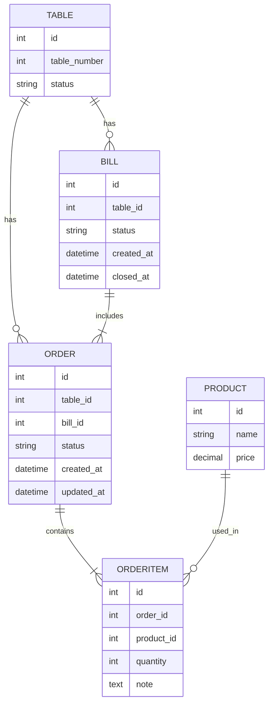

```mermaid
erDiagram
TABLE ||--o{ BILL : has
TABLE ||--o{ ORDER : has
BILL ||--|{ ORDER : includes
ORDER ||--|{ ORDERITEM : contains
PRODUCT ||--o{ ORDERITEM : used_in

    TABLE {
        int id
        int table_number
        string status
    }

    PRODUCT {
        int id
        string name
        decimal price
    }

    BILL {
        int id
        int table_id
        string status
        datetime created_at
        datetime closed_at
    }

    ORDER {
        int id
        int table_id
        int bill_id
        string status
        datetime created_at
        datetime updated_at
    }

    ORDERITEM {
        int id
        int order_id
        int product_id
        int quantity
        text note
    }
```
